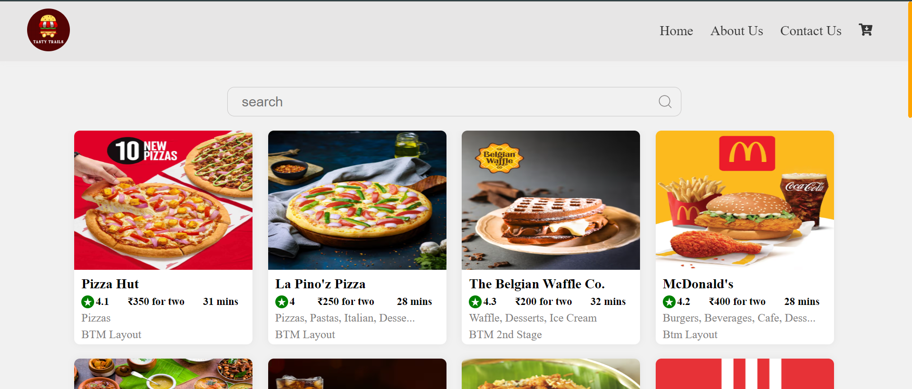

# _Chapter 05 - Let's Get Hooked_


## Coding Assignment:
- `Clean up` your code.
- Create a `Folder Structure` for your app.
- Make `different files` for each Component.
- Create a `config file`.
- Use all types of `import and export`.
- Create a `Search Box` in your App.
- Use `useState` to create a variable and `bind` it to the input box.
- Try to make your `search bar work`.


<br/>

# [_Live Link of Tasty Trails Food App Project_ 🤩](https://tasty-trails-episode05.netlify.app/)

<br/>

```html
<!-- index.html -->
<!DOCTYPE html>
<html lang="en">
  <head>
    <meta charset="UTF-8" />
    <meta name="viewport" content="width=device-width, initial-scale=1.0" />
    <title>Tasty Trails | Delicious Food for You</title>
  </head>
  <body>
    <div id="root">
      <h1>Not Rendered</h1>
    </div>

    <!-- Injected External JavaScript File -->
        <script type="module" src="../Episode 05 - Let's Get Hooked/Theory - Notes, Assignments & Assignment Solution/Assignment Solution/Coding Assignment Solution/App.js"></script>
  </body>
</html>
```


```css
/* index.css */
* {
  margin: 0;
  padding: 0;
  box-sizing: border-box;
  overflow-x: hidden;
}

body {
  background-color: #f1f1f1;
}

/* CSS for scroll-bar */
/* width */
::-webkit-scrollbar {
  width: 7px;
}

/* Track */
::-webkit-scrollbar-track {
  color: orange;
  background-color: #d8d6d6;
}

/* Handle */
::-webkit-scrollbar-thumb {
  background-color: orange;
  border-radius: 10px;
}

/* Handle on hover */
::-webkit-scrollbar-thumb:hover {
  background: #555;
}

.app {
  width: 100%;
  display: flex;
  flex-direction: column;
  justify-content: space-between;
  align-items: center;
  min-height: 100vh;
}

/* Restaurant Header CSS */
.header {
  width: auto;
  display: flex;
  justify-content: space-between;
  align-items: center;
  padding: 10px 3%;
  background-color: #d8d6d6;
  box-shadow: 0 0 10px rgba(216, 215, 215, 0.1);
  position: fixed;
  top: 0;
  right: 0;
  left: 0;
  z-index: 1000;
}

.logo {
  width: 60px;
  height: 60px;
  border-radius: 50%;
  cursor: pointer;
}

.nav-items > ul {
  display: flex;
}

.nav-items > ul > li {
  list-style: none;
  color: #000;
  font-size: 1.2em;
  font-weight: 500;
  cursor: pointer;
  padding: 0px 12px;
}

.nav-items > ul > li:hover {
  color: orange;
}

/* Restaurant Body CSS */
.body {
  width: 100%;
  display: flex;
  flex-direction: column;
  align-items: center;
  margin-top: 120px;
}

.search-box {
  width: 50%;
  display: flex;
  justify-content: space-between;
  align-items: center;
  margin-bottom: 30px;
  border: 1px solid #c9c8c8;
  padding: 0px 10px;
  border-radius: 10px;
  font-size: 1.2rem;
}

.search-box > input {
  height: 40px;
  padding: 0px 10px;
  outline: none;
  border: none;
  background-color: #f1f1f1;
  width: 90%;
  font-size: 1.2rem;
}

.search-icon {
  color: #828080;
  font-size: 1.5rem;
  cursor: pointer;
}

.restaurant-container {
  width: 85%;
  display: flex;
  flex-wrap: wrap;
  justify-content: center;
  align-items: center;
  column-gap: 2%;
  row-gap: 20px;
}

.restaurant-card {
  width: 250px;
  height: 300px;
  background-color: #fff;
  border-radius: 8px;
  box-shadow: 0 0 10px rgba(96, 96, 96, 0.1);
  cursor: pointer;
}

.restaurant-card:hover {
  transform: scale(0.99);
}

.search {
  padding: 10px;
}

.restaurant-logo {
  width: 100%;
  height: 65%;
  margin: 0px;
  border-radius: 8px 8px 0px 0px;
}

.restaurant-name {
  font-size: 1.2rem;
  font-weight: 700;
  margin: 5px 0px;
}

.restaurant-details {
  height: fit-content;
  padding: 0px 10px;
  overflow: hidden;
  font-size: 15px;
}

.esa-rating {
  display: flex;
  align-items: center;
  justify-content: space-between;
  margin: 5px 0px;
  margin-right: 10px;
}

.rating {
  display: flex;
  align-items: center;
}

.rating-logo {
  background-color: green;
  color: white;
  width: 18px;
  height: 18px;
  border-radius: 50%;
  padding: 2px;
  margin-right: 3px;
}

.cousine,
.location {
  color: #828080;
  font-weight: 500;
  font-size: 16px;
  padding-bottom: 5px;
}

/* Footer CSS */
.footer {
  width: 100%;
  text-align: center;
  padding: 20px;
  margin-top: 30px;
  border-radius: 5px;
  background-color: #d8d6d6;
  box-shadow: 0 0 10px rgba(216, 215, 215, 0.1);
}

.footer > strong {
  padding-left: 5px;
}

.footer > span {
  margin: 0px 5px;
  font-size: 20px;
}

.footer > strong > span {
  color: orange;
}
```


```js
// App.js
import React from "react";
import ReactDOM from "react-dom/client";
import "./index.css";
import Header from "./src/components/Header";
import Body from "./src/components/Body";
import Footer from "./src/components/Footer";

const App = () => {
  return (
    <div className="app">
      <Header />
      <Body />
      <Footer />
    </div>
  );
};

const root = ReactDOM.createRoot(document.getElementById("root"));
root.render(<App />);
```


```js
// Header.js
import tastyTrailsLogo from "../../../../../../public/images/tasty-trails-logo.png";
import { FaCartArrowDown } from "react-icons/fa";

const Header = () => {
  return (
    <div className="header">
      <div className="logo-container">
        
      </div>
      
      <div className="nav-items">
        <ul>
          <li>Home</li>
          <li>About Us</li>
          <li>Contact Us</li>
          <li><FaCartArrowDown /></li>
        </ul>
      </div>
    </div>
  );
};

export default Header;
```


```js
// constants.js
export const IMAGE_CDN_URL = "https://media-assets.swiggy.com/swiggy/image/upload/fl_lossy,f_auto,q_auto,w_660/";

export const LINKEDIN_URL = "https://www.linkedin.com/in/bharat2044/";
```


```js
// mockData.js
import RestaurantCard from "./RestaurantCard";

const resList = [
  {
    info: {
      id: "10894",
      name: "Pizza Hut",
      cloudinaryImageId: "2b4f62d606d1b2bfba9ba9e5386fabb7",
      locality: "2nd Stage",
      areaName: "BTM Layout",
      costForTwo: "₹350 for two",
      cuisines: ["Pizzas"],
      avgRating: 4.1,
      parentId: "721",
      avgRatingString: "4.1",
      totalRatingsString: "10K+",
      deliveryTime: 31,
    },
  },
  {
    info: {
      id: "211192",
      name: "La Pino'z Pizza",
      cloudinaryImageId: "lczhp9lptdzbqn09nfns",
      locality: "2nd Stage",
      areaName: "BTM Layout",
      costForTwo: "₹250 for two",
      cuisines: ["Pizzas", "Pastas", "Italian", "Desserts", "Beverages"],
      avgRating: 4,
      parentId: "4961",
      avgRatingString: "4.0",
      totalRatingsString: "10K+",
      deliveryTime: 28,
    },
  },
  {
    info: {
      id: "477963",
      name: "The Belgian Waffle Co.",
      cloudinaryImageId: "5116a385bac0548e06c33c08350fbf11",
      locality: "2nd Stage",
      areaName: "BTM 2nd Stage",
      costForTwo: "₹200 for two",
      cuisines: ["Waffle", "Desserts", "Ice Cream"],
      avgRating: 4.3,
      veg: true,
      parentId: "2233",
      avgRatingString: "4.3",
      totalRatingsString: "1K+",
      deliveryTime: 32,
    },
  },
  {
    info: {
      id: "23683",
      name: "McDonald's",
      cloudinaryImageId:
        "RX_THUMBNAIL/IMAGES/VENDOR/2024/4/1/1c999aef-c166-496d-a9f1-8508e83e6d5a_23683.jpg",
      locality: "2nd Stage",
      areaName: "Btm Layout",
      costForTwo: "₹400 for two",
      cuisines: ["Burgers", "Beverages", "Cafe", "Desserts"],
      avgRating: 4.2,
      parentId: "630",
      avgRatingString: "4.2",
      totalRatingsString: "10K+",
      deliveryTime: 28,
    },
  },
  {
    info: {
      id: "255038",
      name: "Andhra Gunpowder",
      cloudinaryImageId: "e996wruqpmrrrqglp7hs",
      locality: "NS Palya",
      areaName: "Btm Layout",
      costForTwo: "₹350 for two",
      cuisines: ["Andhra", "Biryani", "South Indian"],
      avgRating: 4.3,
      parentId: "10496",
      avgRatingString: "4.3",
      totalRatingsString: "5K+",
      deliveryTime: 29,
    },
  },
  {
    info: {
      id: "240178",
      name: "Leon's - Burgers & Wings (Leon Grill)",
      cloudinaryImageId:
        "RX_THUMBNAIL/IMAGES/VENDOR/2024/5/2/4c1e29e2-fecf-41b6-8b21-5a58338247fe_240178.jpg",
      locality: "Indiranagar",
      areaName: "JP Nagar",
      costForTwo: "₹300 for two",
      cuisines: ["American", "Snacks", "Turkish", "Portuguese", "Continental"],
      avgRating: 4.3,
      parentId: "371281",
      avgRatingString: "4.3",
      totalRatingsString: "10K+",
      deliveryTime: 39,
    },
  },
  {
    info: {
      id: "290271",
      name: "Thalairaj Biryani",
      cloudinaryImageId: "qf8lwn0ehi8sgvjvsi2l",
      locality: "5th Phase",
      areaName: "JP Nagar",
      costForTwo: "₹300 for two",
      cuisines: [
        "Andhra",
        "Biryani",
        "Hyderabadi",
        "South Indian",
        "Indian",
        "Beverages",
      ],
      avgRating: 4.2,
      parentId: "433875",
      avgRatingString: "4.2",
      totalRatingsString: "1K+",
      deliveryTime: 35,
    },
  },
  {
    info: {
      id: "17312",
      name: "KFC",
      cloudinaryImageId:
        "RX_THUMBNAIL/IMAGES/VENDOR/2024/4/17/768a43ed-602d-4e08-b6ab-a2bf8f7d3e33_17312.JPG",
      locality: "4th Phase",
      areaName: "JP Nagar",
      costForTwo: "₹400 for two",
      cuisines: ["Burgers", "Fast Food", "Rolls & Wraps"],
      avgRating: 4.1,
      parentId: "547",
      avgRatingString: "4.1",
      totalRatingsString: "10K+",
      deliveryTime: 27,
    },
  },
  {
    info: {
      id: "49704",
      name: "California Burrito",
      cloudinaryImageId: "p57honbbzdgf7tyt2vay",
      locality: "5th Phase",
      areaName: "JP Nagar",
      costForTwo: "₹250 for two",
      cuisines: [
        "Mexican",
        "American",
        "Salads",
        "Continental",
        "Keto",
        "Healthy Food",
        "Desserts",
      ],
      avgRating: 4.5,
      parentId: "1252",
      avgRatingString: "4.5",
      totalRatingsString: "10K+",
      deliveryTime: 35,
    },
  },
  {
    info: {
      id: "246645",
      name: "Great Indian Khichdi by EatFit",
      cloudinaryImageId: "6e44fd7f1e5cd9967edfe47c10247671",
      locality: "2nd Stage",
      areaName: "BTM Layout",
      costForTwo: "₹200 for two",
      cuisines: [
        "Home Food",
        "Indian",
        "North Indian",
        "Healthy Food",
        "Snacks",
        "Desserts",
        "Rajasthani",
        "South Indian",
        "Maharashtrian",
        "Sweets",
      ],
      avgRating: 4.2,
      parentId: "319582",
      avgRatingString: "4.2",
      totalRatingsString: "1K+",
      deliveryTime: 29,
    },
  },
  {
    info: {
      id: "643652",
      name: "WeFit - Protein Bowls, Salads & Sandwiches",
      cloudinaryImageId:
        "RX_THUMBNAIL/IMAGES/VENDOR/2024/5/23/8162aab2-4ccd-431e-8163-ad18749b95f5_643652.JPG",
      locality: "16TH MAIN",
      areaName: "BTM",
      costForTwo: "₹250 for two",
      cuisines: ["Healthy Food", "Salads", "Keto", "Snacks"],
      avgRating: 4.4,
      parentId: "355285",
      avgRatingString: "4.4",
      totalRatingsString: "100+",
      deliveryTime: 35,
    },
  },
  {
    info: {
      id: "750212",
      name: "Daily Kitchen - Homely Meals",
      cloudinaryImageId:
        "RX_THUMBNAIL/IMAGES/VENDOR/2024/5/19/4ec6a5b6-7c8d-4e10-b8a3-317922e419da_750212.JPG",
      locality: "2nd stage",
      areaName: "BTM Layout",
      costForTwo: "₹400 for two",
      cuisines: ["Home Food", "Indian", "North Indian", "Thalis"],
      avgRating: 4.3,
      parentId: "444382",
      avgRatingString: "4.3",
      totalRatingsString: "50+",
      deliveryTime: 30,
    },
  },
  {
    info: {
      id: "390045",
      name: "NH1 Bowls - Highway To North",
      cloudinaryImageId:
        "RX_THUMBNAIL/IMAGES/VENDOR/2024/5/18/8dd09eab-b40e-43ed-b46d-c88f50e450a3_390045.JPG",
      locality: "2nd stage",
      areaName: "Btm Layout",
      costForTwo: "₹250 for two",
      cuisines: ["North Indian", "Punjabi", "Home Food"],
      avgRating: 4.6,
      parentId: "22452",
      avgRatingString: "4.6",
      totalRatingsString: "100+",
      deliveryTime: 30,
    },
  },
  {
    info: {
      id: "374525",
      name: "Kwality Walls Frozen Dessert and Ice Cream Shop",
      cloudinaryImageId: "npp2m7tuszixwcc69pqd",
      locality: "2nd Stage",
      areaName: "Btm Layout",
      costForTwo: "₹300 for two",
      cuisines: ["Desserts", "Ice Cream", "Ice Cream Cakes"],
      avgRating: 4.6,
      veg: true,
      parentId: "582",
      avgRatingString: "4.6",
      totalRatingsString: "1K+",
      deliveryTime: 20,
    },
  },
  {
    info: {
      id: "758321",
      name: "NIC Ice Creams",
      cloudinaryImageId: "5bbe809ee274743ba5e09eab110cd813",
      locality: "MICO Employees Grinirman",
      areaName: "BTM layout",
      costForTwo: "₹120 for two",
      cuisines: ["Ice Cream", "Desserts"],
      avgRating: 4.9,
      veg: true,
      parentId: "6249",
      avgRatingString: "4.9",
      totalRatingsString: "10+",
      deliveryTime: 16,
    },
  },
  {
    info: {
      id: "590119",
      name: "Bakingo",
      cloudinaryImageId:
        "RX_THUMBNAIL/IMAGES/VENDOR/2024/4/24/11e95f9e-ba33-472c-85ae-ed6d5c289992_590119.JPG",
      locality: "1st  Stage",
      areaName: "BTM Layout",
      costForTwo: "₹299 for two",
      cuisines: ["Bakery", "Desserts", "Beverages", "Snacks"],
      avgRating: 4.3,
      parentId: "3818",
      avgRatingString: "4.3",
      totalRatingsString: "1K+",
      deliveryTime: 27,
    },
  },
  {
    info: {
      id: "399138",
      name: "Aubree",
      cloudinaryImageId: "65faa4b5046cb2215fe285a8b96c9bd7",
      locality: "JP Nagar",
      areaName: "JP Nagar",
      costForTwo: "₹700 for two",
      cuisines: ["Bakery", "Italian", "Snacks", "Desserts"],
      avgRating: 4.5,
      parentId: "3807",
      avgRatingString: "4.5",
      totalRatingsString: "1K+",
      deliveryTime: 33,
    },
  },
  {
    info: {
      id: "108097",
      name: "Ambur Star Briyani Since 1890",
      cloudinaryImageId: "yktanq9i7yfjrixaghuj",
      locality: "2nd Stage",
      areaName: "BTM Layout",
      costForTwo: "₹500 for two",
      cuisines: ["Biryani", "Chettinad", "Andhra", "Beverages", "Seafood"],
      avgRating: 4.3,
      parentId: "21400",
      avgRatingString: "4.3",
      totalRatingsString: "10K+",
      deliveryTime: 21,
    },
  },
  {
    info: {
      id: "622017",
      name: "MOJO Pizza - 2X Toppings",
      cloudinaryImageId:
        "RX_THUMBNAIL/IMAGES/VENDOR/2024/5/20/0fbf3dd4-03fc-403e-b861-6d7455bcb69b_622017.JPG",
      locality: "BTM Layout",
      areaName: "Btm 2nd Stage",
      costForTwo: "₹250 for two",
      cuisines: ["Pizzas", "Italian", "Fast Food", "Desserts"],
      avgRating: 4.5,
      parentId: "11329",
      avgRatingString: "4.5",
      totalRatingsString: "500+",
      deliveryTime: 35,
    },
  },
  {
    info: {
      id: "558760",
      name: "HRX by EatFit",
      cloudinaryImageId: "d8d85afa5c5e92461d30ff2ca867a587",
      locality: "2nd Stage",
      areaName: "BTM Layout",
      costForTwo: "₹450 for two",
      cuisines: ["Healthy Food", "Salads", "Keto", "Pastas"],
      avgRating: 4.3,
      parentId: "335529",
      avgRatingString: "4.3",
      totalRatingsString: "100+",
      deliveryTime: 35,
    },
  },
];
```


```js
// Body.js
import { useState } from "react";
import { CiSearch } from "react-icons/ci";
import RestaurantCard from "./RestaurantCard";
import restaurantList from "../config/mockData";

const Body = () => {
  const [searchText, setSearchText] = useState("");

  const handleSearchChange = (e) => {
    setSearchText(e.target.value);
  };

  const filteredRestaurants = restaurantList.filter((restaurant) => (
    restaurant.info.name.toLowerCase().includes(searchText.toLowerCase()) || 
    restaurant.info.areaName.toLowerCase().includes(searchText.toLowerCase()) ||
    restaurant.info.cuisines.join(", ").toLowerCase().includes(searchText.toLowerCase())
  ));

  return (
    <div className="body">
      <div className="search-box">
        <input
          type="text"
          value={searchText}
          onChange={handleSearchChange}
          placeholder="search a restaurant you want..."
        />
        <CiSearch className="search-icon" />
      </div>

      <div className="restaurant-container">
        {filteredRestaurants.map((restaurant) => (
          <RestaurantCard
            key={restaurant.info.id}
            restaurantData={restaurant}
          />
        ))}
      </div>
    </div>
  );
};

export default Body;
```


```js
// RestaurantCard.js
import { MdStarRate } from "react-icons/md";
import { IMAGE_CDN_URL } from "../config/constants";

const RestaurantCard = (props) => {
  const { restaurantData } = props;

  const {
    cloudinaryImageId,
    name,
    areaName,
    avgRating,
    cuisines,
    costForTwo,
    deliveryTime,
  } = restaurantData?.info;

  return (
    <div className="restaurant-card">
      
      <div className="restaurant-details">
        <h3 className="restaurant-name">
          {name.slice(0, 22)}
          {name.length > 22 ? "..." : ""}
        </h3>
        <div className="esa-rating">
          <h4 className="rating">
            <MdStarRate className="rating-logo" />
            <span>{avgRating}</span>
          </h4>
          <h4>{costForTwo}</h4>
          <h4>{deliveryTime} mins</h4>
        </div>
        <p className="cousine">
          {cuisines.join(", ").slice(0, 30)}
          {cuisines.join(", ").length > 30 ? "..." : ""}
        </p>
        <p className="location">{areaName}</p>
      </div>
    </div>
  );
};

export default RestaurantCard;
```


```js
// Footer.js
import {LINKEDIN_URL} from "../config/constants";

const Footer = () => {
  const year = new Date().getFullYear();
  return (
    <div className="footer">
      Created By
      <span>❤️</span>
      <a href={LINKEDIN_URL} target="_blank">
        <strong>Bharat Kumar</strong>
      </a>
      <span>&copy;</span>
      {year}
      <strong>
        Tasty <span>Trails</span>
      </strong>
    </div>
  );
};

export default Footer;
```

<br/>
<br/>

# [_Live Link of Tasty Trails Food App Project_ 🤩](https://tasty-trails-episode05.netlify.app/)

<br/>

