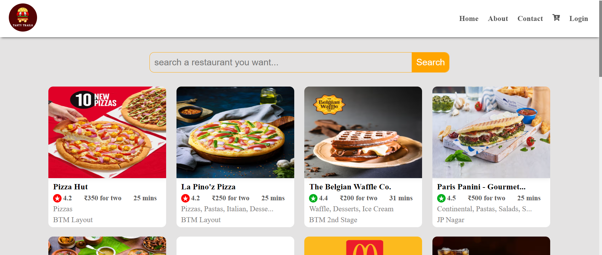

# _Episode 06 - Exploring the World_

## Coding Assignment:

- Play with the `useEffect Hook` to see when it is called? (before or after render)
- Play with the `dependency array` in useEffect Hook.
- Play with the `developer console` by putting a `debugger` in render and `useEffect`.
- Call an `actual API call`.
- `Handle Error` in your `API call`.
- Build `Shimmer UI` when `data is not loaded`.
- `Render your UI` with `actual API data`.
- Make `Search functionality` work.
- Make a `Login Logout` button that `toggles with a state`.

<br/>

# [_Live Link of Tasty Trails Food App Project_ 🤩](https://tasty-trails-episode06.netlify.app/)

<br/>

```html
<!-- index.html -->
<!DOCTYPE html>
<html lang="en">
  <head>
    <meta charset="UTF-8" />
    <meta name="viewport" content="width=device-width, initial-scale=1.0" />
    <!-- <title>Namaste React</title> -->
    <title>Tasty Trails | Delicious Food for You</title>
    <link
      rel="shortcut icon"
      href="./images/tasty-trails-logo.png"
      type="image/x-icon"
    />
  </head>
  <body>
    <div id="root">
      <h1>Not Rendered</h1>
    </div>

    <!-- Injected External JavaScript File -->
    <script
      type="module"
      src="../Episode 06 - Exploring the World/Theory - Notes, Assignments & Assignment Solution/Assignment Solution/Coding Assignment Solution/App.js"
    ></script>
  </body>
</html>
```


```js
// constants.js
// Swiggy API for to get Restaurant data
export const SWIGGY_API_URL = `https://www.swiggy.com/dapi/restaurants/list/v5?lat=12.9046136&lng=77.614948&is-seo-homepage-enabled=true&page_type=DESKTOP_WEB_LISTING`;

//  Swiggy API for to get Restaurant Item 
export const MENU_API_URL = `https://www.swiggy.com/dapi/menu/pl?page-type=REGULAR_MENU&complete-menu=true&lat=12.9046136&lng=77.614948&restaurantId=`;

// Restaurant Item Image CDN URL for Restaurant card
export const IMG_CDN_URL = `https://media-assets.swiggy.com/swiggy/image/upload/fl_lossy,f_auto,q_auto,w_300,h_300,c_fit/`;

// Swiggy Restaurant Path 
export const SWIGGY_REST_API_PATH = `data?.cards[1]?.card?.card?.gridElements?.infoWithStyle?.restaurants`;


// Social Media Links - URL
export const LINKEDIN_LINK = "https://www.linkedin.com/in/bharat2044/";
export const GiTHUB_LINK = "https://github.com/Bharat2044";
export const TWITTER_LINK = "https://x.com/bharat__2044/";
export const EMAIL_LINK = "mailto:bharatkumar204451@gmal.com";


// Github - username and repository name
export const GITHUB_USERNAME = "Bharat2044";
export const GITHUB_REPOSITORY_NAME = "Namaste-React";

// Github API for User
export const GITHUB_USER_API = "https://api.github.com/users/";

// Github API for Repository
export const GITHUB_REPO_API = "https://api.github.com/repos/";
```


```css
/* index.css */
/* Select all CSS */
* {
  margin: 0;
  padding: 0;
  box-sizing: border-box;
  overflow-x: hidden;
}

/* CSS for scroll-bar */
/* width */
::-webkit-scrollbar {
  width: 7px;
}

/* Track */
::-webkit-scrollbar-track {
  background: #f1f1f1;
  border-radius: 10px;
}

/* Handle */
::-webkit-scrollbar-thumb {
  background: #888;
}

/* Handle on hover */
::-webkit-scrollbar-thumb:hover {
  background: #555;
}

body {
  background-color: #e4e3e3;
}

/* create global variable with :root selector */
:root {
  --header-bg-color: rgb(255, 255, 255);
  --footer-bg-color: rgb(255, 255, 255);
  --body-bg-color: #e3e3e3;
  --text-color: #000;
  --green: #00ad1d;
  --orange: #ffa500;
  --red: #ff0000;
  --box-shadow: 0 0 10px rgba(216, 215, 215, 0.1);
  --border-radius: 10px;
  --light-text-color: #545454;
  --white: #fff;
}

.app {
  width: 100%;
  display: flex;
  flex-direction: column;
  justify-content: space-between;
  align-items: center;
  min-height: 100vh;
}

/* Restaurant Header CSS */
.header {
  display: flex;
  justify-content: space-between;
  align-items: center;
  width: 100vw;
  height: 80px;
  background-color: var(--header-bg-color);
  box-shadow: -2px 7px 5px -6px rgba(0, 0, 0, 0.61);
  color: var(--light-text-color);
  font-weight: bold;
  position: fixed;
  top: 0;
  left: 0;
  z-index: 999;
  overflow-y: hidden;
  padding: 0px 20px;
}

.logo {
  width: 60px;
  height: 60px;
  border-radius: 50%;
  cursor: pointer;
}

.nav-items > ul {
  list-style-type: none;
  display: flex;
  align-items: center;
  justify-content: space-between;
}

.nav-items > ul > li,
.login {
  padding: 10px;
  cursor: pointer;
}

.nav-items > ul > li:hover,
.login:hover {
  background-color: var(--orange);
  border-radius: 5px;
  cursor: pointer;
  color: var(--white);
}

.login {
  border: none;
  background-color: transparent;
  color: var(--light-text-color);
  font-size: 16px;
  font-weight: bold;
  font-family: "Times New Roman", Times, serif;
}

/* Restaurant Body CSS */
.body {
  width: 100%;
  display: flex;
  flex-direction: column;
  align-items: center;
  margin-top: 120px;
  transition: 0.3s;
}

.restaurant-container,
.shimmer-container {
  width: 85%;
  display: flex;
  flex-wrap: wrap;
  justify-content: center;
  align-items: center;
  column-gap: 2%;
  row-gap: 20px;
}

.shimmer-container {
  margin-top: 120px;
}

.restaurant-card,
.shimmer-card {
  width: 250px;
  height: 300px;
  background-color: #fff;
  border-radius: var(--border-radius);
  box-shadow: var(--box-shadow);
  cursor: pointer;
}

.shimmer-card {
  background-color: #cecccc;
}

.restaurant-card:hover {
  transform: scale(0.98);
}

.search-box {
  width: 50%;
  display: flex;
  justify-content: space-between;
  align-items: center;
  margin-bottom: 30px;
  border: 1px solid var(--orange);
  border-radius: var(--border-radius);
}

.shimmer-search-box {
  width: 50%;
  height: 50px;
  background-color: #cecccc;
  border-radius: var(--border-radius);
  margin-bottom: 30px;
}

.search-box > input {
  padding: 10px;
  font-size: 1.2rem;
  outline: none;
  border: none;
  background-color: transparent;
  width: 90%;
}

.search-box > .search {
  font-size: 1.2rem;
  color: white;
  background-color: var(--orange);
  cursor: pointer;
  border-radius: 0px var(--border-radius) var(--border-radius) 0px;
  border: none;
  padding: 10px;
}

.search-box > .search:hover {
  background-color: tomato;
  transition: 0.3s;
}

.search {
  padding: 10px;
}

.restaurant-logo {
  width: 100%;
  height: 65%;
  border-radius: var(--border-radius) var(--border-radius) 0px 0px;
  box-shadow: 0px 0px 10px rgba(0, 0, 0, 0.1);
}

.restaurant-details {
  height: fit-content;
  padding: 0px 10px;
  overflow: hidden;
  font-size: 15px;
}

.restaurant-name {
  font-weight: 700;
  margin: 5px 0px;
}

.esa-rating {
  display: flex;
  align-items: center;
  justify-content: space-between;
  margin: 5px 0px;
  margin-right: 10px;
  color: rgb(84, 84, 84);
}

.rating {
  display: flex;
  align-items: center;
}

.rating-logo {
  color: white;
  width: 18px;
  height: 18px;
  border-radius: 50%;
  padding: 2px;
  margin-right: 3px;
}

.cousine,
.location {
  color: #828080;
  font-weight: 500;
  font-size: 16px;
  padding-bottom: 5px;
}

/* Footer CSS */
.footer {
  width: 100%;
  text-align: center;
  padding: 20px;
  margin-top: 30px;
  background-color: var(--footer-bg-color);
  box-shadow: -2px 7px 5px -6px rgba(0, 0, 0, 0.61);
}

.footer > strong {
  padding-left: 5px;
}

.footer > span {
  margin: 0px 5px;
  font-size: 20px;
}

.footer > strong > span {
  color: var(--orange);
}
```


```js
/* App.js */
import React from "react";
import ReactDOM from "react-dom/client";
import "./index.css";
import Header from "./src/components/Header";
import Body from "./src/components/Body";
import Footer from "./src/components/Footer";

const App = () => {
  return (
    <div className="app">
      <Header />
      <Body />
      <Footer />
    </div>
  );
};

const root = ReactDOM.createRoot(document.getElementById("root"));
root.render(<App />);
```


```js
/* Header.js */
import { useState } from "react";
import tastyTrailsLogo from "../../../../../../public/images/tasty-trails-logo.png";
import { FaCartArrowDown } from "react-icons/fa";

const Header = () => {
  const [login, setLogin] = useState(false);

  return (
    <div className="header">
      <div className="logo-container">
        <a href="/">
          
        </a>
      </div>

      <div className="nav-items">
        <ul>
          <li>Home</li>
          <li>About</li>
          <li>Contact</li>
          <li>
            <FaCartArrowDown />
          </li>
          <button className="login" onClick={() => setLogin(!login)}>
            {login ? "Logout" : "Login"}
          </button>
        </ul>
      </div>
    </div>
  );
};

export default Header;
```


```js
/* Body.js */
import { useState, useEffect } from "react";
import RestaurantCard from "./RestaurantCard";
import Shimmer from "./Shimmer";
import {
  SWIGGY_API_URL,
  SWIGGY_REST_API_PATH,
} from "../../../../../../public/common/constants";

const Body = () => {
  const [restaurantList, setRestaurantList] = useState([]);
  const [searchRestaurant, setSearchRestaurant] = useState("");
  const [filteredRestaurants, setFilteredRestaurants] = useState([]);
  const [restaurantName, setRestaurantName] = useState("");

  const fetchData = async () => {
    try {
      const data = await fetch(SWIGGY_API_URL);
      const json = await data.json();
      const restaurants = eval("json?." + SWIGGY_REST_API_PATH) || [];

      setRestaurantList(restaurants);
      setFilteredRestaurants(restaurants);
    } catch (error) {
      console.error("Error fetching data:", error);
    }
  };

  useEffect(() => {
    fetchData();
  }, []);

  const handleSearch = () => {
    const filtered = restaurantList.filter((res) =>
      res.info.name.toLowerCase().includes(searchRestaurant.toLowerCase())
    );

    setFilteredRestaurants(filtered);
    setSearchRestaurant(""); // Clear the search input box after search
    setRestaurantName(searchRestaurant);
  };

  // Conditional rendering using ternary operator
  return restaurantList.length === 0 ? (
    <Shimmer />
  ) : (
    <div className="body">
      <div className="search-box">
        <input
          type="text"
          value={searchRestaurant}
          onChange={(e) => setSearchRestaurant(e.target.value)}
          placeholder="search a restaurant you want..."
        />
        <button className="search" onClick={handleSearch}>
          Search
        </button>
      </div>

      <div className="restaurant-container">
        {filteredRestaurants.length !== 0 ? (
          filteredRestaurants.map((restaurant) => (
            <RestaurantCard key={restaurant?.info?.id} {...restaurant?.info} />
          ))
        ) : (
          <h2>Sorry, we couldn't find any restaurant for "{restaurantName}"</h2>
        )}
      </div>
    </div>
  );
};

export default Body;
```

```js
/* Shimmir.js */
import React from "react";

function Shimmer() {
  return (
    <div className="body">
      <div className="shimmer-search-box"></div>
      <div className="restaurant-container">
        <div className="shimmer-card"></div>
        <div className="shimmer-card"></div>
        <div className="shimmer-card"></div>
        <div className="shimmer-card"></div>
        <div className="shimmer-card"></div>
        <div className="shimmer-card"></div>
        <div className="shimmer-card"></div>
        <div className="shimmer-card"></div>
        <div className="shimmer-card"></div>
        <div className="shimmer-card"></div>
        <div className="shimmer-card"></div>
        <div className="shimmer-card"></div>
        <div className="shimmer-card"></div>
        <div className="shimmer-card"></div>
        <div className="shimmer-card"></div>
        <div className="shimmer-card"></div>
        <div className="shimmer-card"></div>
        <div className="shimmer-card"></div>
        <div className="shimmer-card"></div>
        <div className="shimmer-card"></div>
      </div>
    </div>
  );
}

export default Shimmer;
```


```js
/* RestaurantCard.js */
import { MdStarRate } from "react-icons/md";
import { IMG_CDN_URL } from "../../../../../../public/common/constants";

const RestaurantCard = ({
  cloudinaryImageId,
  name,
  areaName,
  sla,
  cuisines,
  costForTwo,
  avgRating,
}) => {
  return (
    <div className="restaurant-card">
      
      <div className="restaurant-details">
        <h3 className="restaurant-name">
          {name.slice(0, 22)}
          {name.length > 22 ? "..." : ""}
        </h3>
        <div className="esa-rating">
          <h4 className="rating">
            <MdStarRate
              className="rating-logo"
              style={
                avgRating > 4.2
                  ? { backgroundColor: "var(--green)" }
                  : { backgroundColor: "var(--red)" }
              }
            />
            <span>{avgRating}</span>
          </h4>
          <h4>{costForTwo}</h4>
          <h4>{sla.deliveryTime} mins</h4>
        </div>
        <p className="cousine">
          {cuisines.join(", ").slice(0, 30)}
          {cuisines.join(", ").length > 30 ? "..." : ""}
        </p>
        <p className="location">{areaName}</p>
      </div>
    </div>
  );
};

export default RestaurantCard;
```


```js
/* Footer.js */
import { LINKEDIN_LINK } from "../../../../../../public/common/constants";

const Footer = () => {
  const year = new Date().getFullYear();
  return (
    <div className="footer">
      Created By
      <span>❤️</span>
      <a href={LINKEDIN_LINK} target="_blank">
        Bharat Kumar
      </a>
      <span>&copy;</span>
      {year}
      <strong>
        Tasty <span>Trails</span>
      </strong>
    </div>
  );
};

export default Footer;
```

<br/>
<br/>

# [_Live Link of Tasty Trails Food App Project_ 🤩](https://tasty-trails-episode06.netlify.app/)

<br/>


