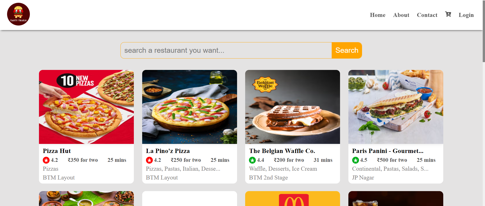

# _Episode 07 - Finding the Path_

## Coding Assignment:
- Add `Shimmer Effect without installing a library`.
- Install `react-router-dom`.
- Create an `appRouter` and `Provide it to the app`.
- Create a `Home, About, and Contact Page` with Link (use child routes).
- Make an `Error page` for `routing errors`.
- Create a `Restaurant Page` with `dynamic restaurant ID`.
- (Extra) - Create a `login Page` using `Formik Library`.

<br/>

# [_Live Link of Tasty Trails Food App Project_ 🤩](https://tasty-trails-episode07.netlify.app/)

<br/>

```html
<!-- index.html -->
<!DOCTYPE html>
<html lang="en">
  <head>
    <meta charset="UTF-8" />
    <meta name="viewport" content="width=device-width, initial-scale=1.0" />
    <!-- <title>Namaste React</title> -->
    <title>Tasty Trails | Delicious Food for You</title>
    <link
      rel="shortcut icon"
      href="./images/tasty-trails-logo.png"
      type="image/x-icon"
    />
  </head>
  <body>
    <div id="root">
      <h1>Not Rendered</h1>
    </div>

    <!-- Injected External JavaScript File -->
    <script type="module" src="../Episode 07 - Finding the Path/Theory - Notes, Assignments & Assignment Solution/Assignment Solution/Coding Assignment Solution/App.js"></script>
  </body>
</html>
```

```js
// constants.js
// Swiggy API for to get Restaurant data
export const SWIGGY_API_URL = `https://www.swiggy.com/dapi/restaurants/list/v5?lat=12.9046136&lng=77.614948&is-seo-homepage-enabled=true&page_type=DESKTOP_WEB_LISTING`;

//  Swiggy API for to get Restaurant Item 
export const MENU_API_URL = `https://www.swiggy.com/dapi/menu/pl?page-type=REGULAR_MENU&complete-menu=true&lat=12.9046136&lng=77.614948&restaurantId=`;

// Restaurant Item Image CDN URL for Restaurant card
export const IMG_CDN_URL = `https://media-assets.swiggy.com/swiggy/image/upload/fl_lossy,f_auto,q_auto,w_300,h_300,c_fit/`;

// Swiggy Restaurant Path 
export const SWIGGY_REST_API_PATH = `data?.cards[1]?.card?.card?.gridElements?.infoWithStyle?.restaurants`;


// Social Media Links - URL
export const LINKEDIN_LINK = "https://www.linkedin.com/in/bharat2044/";
export const GiTHUB_LINK = "https://github.com/Bharat2044";
export const TWITTER_LINK = "https://x.com/bharat__2044/";
export const EMAIL_LINK = "mailto:bharatkumar204451@gmal.com";


// Github - username and repository name
export const GITHUB_USERNAME = "Bharat2044";
export const GITHUB_REPOSITORY_NAME = "Namaste-React";

// Github API for User
export const GITHUB_USER_API = "https://api.github.com/users/";

// Github API for Repository
export const GITHUB_REPO_API = "https://api.github.com/repos/";
```

```css
/* index.css */
/* Select all CSS */
* {
  margin: 0;
  padding: 0;
  box-sizing: border-box;
  overflow-x: hidden;
}

/* CSS for scroll-bar */
/* width */
::-webkit-scrollbar {
  width: 7px;
}

/* Track */
::-webkit-scrollbar-track {
  background: #f1f1f1;
  border-radius: 10px;
}

/* Handle */
::-webkit-scrollbar-thumb {
  background: #888;
  border-radius: 10px;
}

/* Handle on hover */
::-webkit-scrollbar-thumb:hover {
  background: #555;
}

body {
  background-color: #e4e3e3;
  font-family: ProximaNova, arial, "Helvetica Neue", sans-serif;
}

a, Link {
  text-decoration: none;
}

/* create global variable with :root selector */
:root {
  --header-bg-color: rgb(255, 255, 255);
  --footer-bg-color: rgb(255, 255, 255);
  --body-bg-color: #e3e3e3;
  --text-color: #000;
  --green: #00ad1d;
  --orange: #E46F20;
  --red: #ff0000;
  --box-shadow: 0 0 10px rgba(216, 215, 215, 0.1);
  --border-radius: 10px;
  --light-text-color: #545454;
  --white: #fff;
  --btn-hover-color: #016034;
}

.app {
  width: 100%;
  display: flex;
  flex-direction: column;
  justify-content: space-between;
  align-items: center;
  min-height: calc(100vh - 120px);
  margin-top: 120px;
}

/* Restaurant Header CSS */
.header {
  display: flex;
  justify-content: space-between;
  align-items: center;
  width: 100vw;
  height: 80px;
  background-color: var(--header-bg-color);
  box-shadow: -2px 7px 5px -6px rgba(0, 0, 0, 0.61);
  color: var(--light-text-color);
  font-weight: bold;
  position: fixed;
  top: 0;
  left: 0;
  z-index: 999;
  overflow-y: hidden;
  padding: 0px 20px;
}

.logo {
  width: 60px;
  height: 60px;
  border-radius: 50%;
  cursor: pointer;
}

.nav-items > ul {
  list-style-type: none;
  display: flex;
  align-items: center;
}

.nav-items > ul > li {
  display: flex;
}

.nav-links, .login {
  padding: 10px;
  cursor: pointer;
  color: inherit;
}

.nav-links:hover, .login:hover {
  background-color: var(--orange);
  border-radius: 5px;
  cursor: pointer;
  color: var(--white);
}

.login {
  border: none;
  background-color: transparent;
  color: var(--light-text-color);
  font-size: 16px;
  font-weight: bold;
}

/* Restaurant Body CSS */
.body {
  width: 100%;
  display: flex;
  flex-direction: column;
  align-items: center;
  transition: 0.3s;
}

.restaurant-container,
.shimmer-container {
  width: 85%;
  display: flex;
  flex-wrap: wrap;
  justify-content: center;
  align-items: center;
  column-gap: 2%;
  row-gap: 20px;
}

.shimmer-container {
  margin-top: 120px;
}

.restaurant-card,
.shimmer-card {
  width: 250px;
  height: 300px;
  background-color: #fff;
  border-radius: var(--border-radius);
  box-shadow: var(--box-shadow);
  cursor: pointer;
  overflow: hidden;
  color: black;
}

.shimmer-card {
  background-color: #cecccc;
}

.restaurant-card:hover {
  transform: scale(0.98);
}

.search-box {
  width: 50%;
  display: flex;
  justify-content: space-between;
  align-items: center;
  margin-bottom: 30px;
}

.shimmer-search-box {
  width: 50%;
  height: 50px;
  background-color: #cecccc;
  border-radius: var(--border-radius);
  margin-bottom: 30px;
}

.search-box > input {
  padding: 10px;
  font-size: 1.2rem;
  color: #3d3d3d;
  background-color: transparent;
  border: 1px solid #818181;
  border-right: none;
  border-radius: var(--border-radius) 0px 0px var(--border-radius);
  outline: none;
  width: 90%;
}

.search-box > input:focus {
  border: 1px solid var(--orange);
}

.search-box > .search {
  padding: 11px;
  font-size: 1.2rem;
  color: var(--white);
  background-color: var(--orange);
  border-radius: 0px var(--border-radius) var(--border-radius) 0px;
  border: none;
  cursor: pointer;
  font-weight: 500;
}

.search-box > .search:hover {
  background-color: var(--btn-hover-color);
  transition: 0.3s;
}

.search {
  padding: 10px;
}

.restaurant-image {
  width: 100%;
  height: 64%;
  border-radius: var(--border-radius) var(--border-radius) 0px 0px;
  box-shadow: 0px 0px 10px rgba(0, 0, 0, 0.1);
}

.restaurant-name {
  font-weight: 700;
  margin: 5px 0px;
}

.restaurant-details {
  height: fit-content;
  padding: 0px 10px;
  overflow: hidden;
  font-size: 15px;
}

.esa-rating {
  display: flex;
  align-items: center;
  justify-content: space-between;
  margin: 5px 0px;
  margin-right: 10px;
  color: rgb(84, 84, 84);
}

.rating {
  display: flex;
  align-items: center;
}

.rating-logo {
  color: var(--white);
  width: 18px;
  height: 18px;
  border-radius: 50%;
  padding: 2px;
  margin-right: 3px;
}

.cousine,
.location {
  color: #828080;
  font-weight: 500;
  font-family: Gilroy, sans-serif;
  font-size: 15px;
  padding-bottom: 5px;
}

/* Footer CSS */
.footer {
  width: 100%;
  text-align: center;
  padding: 20px;
  margin-top: 30px;
  background-color: var(--footer-bg-color);
  box-shadow: -2px 7px 5px -6px rgba(0, 0, 0, 0.61);
}

.linkedin-name {
  color: purple;
  font-weight: bold;
}

.footer > strong {
  padding-left: 5px;
}

.footer > span {
  margin: 0px 5px;
  font-size: 20px;
}

.footer > strong > span {
  color: var(--orange);
}


/* Error */
.error-page {
  display: flex;
  justify-content: center;
  align-items: center;
  height: calc(100vh - 40px);
  flex-direction: column;
  row-gap: 10px;
  margin: 20px 10px;
}

.error-image {
  display: flex;
  justify-content: center;
  align-items: center;  
}

.error-image > img {
  width: 90%;
}

.error-details {
  display: flex;
  flex-direction: column;
  align-items: center;
  row-gap: 10px;
}

.error-back-home {
  display: flex;
  justify-content: center;
  align-items: center;
  row-gap: 10px;

}

.error-back-home > .link-name {
  padding: 10px;
  background-color: #E46F20;
  color: var(--white);
  border-radius: var(--border-radius);
  cursor: pointer;
}

.error-back-home > .link-name:hover {
  background-color: var(--btn-hover-color);
  transition: 0.3s;
}
```


```css
/* RestaurantMenu.css */
.menu, .shimmer-menu {
  width: 60%;
}

.restaurant-header, .shimmer-menu .shimmer-card {
  display: flex;
  align-items: center;
  background-color: black;
  color: white;
  padding: 20px;
  border-radius: 10px;
  margin-bottom: 30px;
  overflow: hidden;
  width: 100%;
}

.restaurant-header img {
  width: 250px;
  height: 150px;
  object-fit: cover;
  border-radius: 10px;
  flex-wrap: wrap;
  margin-right: 40px;
}

.restaurant-header-details {
  display: flex;
  flex-direction: column;
  justify-content: center;
  gap: 5px;
}

.restaurant-header-details h1 {
  font-size: 20px;
}

.restaurant-header h3 {
  color: #bcbcbc;
}

.restaurant-header p {
  font-size: 15px;
  color: rgb(193, 185, 185);
}

.rating-time {
  color: white;
  font-size: 16px;
  display: flex;
  gap: 20px;
}

.restaurant-header .rating-logo {
  font-size: 20px;
  border-radius: 50%;
  padding: 2px;
  margin-right: 5px;
}

.menu-items, .shimmer-menu .shimmer-card {
  display: flex;
  justify-content: space-between;
  align-items: center;
  padding: 40px 0;
  border-bottom: 1px solid rgb(91, 91, 91);
  gap: 50px;
}

.menu-items .left {
  display: flex;
  flex-direction: column;
  gap: 5px;
}

.left .rating span {
  color: rgb(72, 71, 71);
}

.menu-items .right {
  display: flex;
  flex-direction: column;
  align-items: center;
  justify-content: center;
}

.menu-items .right img {
  width: 150px;
  height: 120px;
  object-fit: cover;
  border-radius: 10px;
}

.right .add-btn {
  background-color: white;
  color: green;
  padding: 10px 30px;
  border-radius: 5px;
  cursor: pointer;
  border: none;
  position: relative;
  bottom: 10px;
  transition: background-color 0.3s;
  font-size: 1.2rem;
  font-weight: 600;
}

.right .add-btn:hover {
  background-color: #E46F20;
  color: white;
  transition: 0.3s;
}

.shimmer-menu .shimmer-card {
  background-color: #d7d6d6;
  height: 200px;
}
```


```css
/* Contact.css */
/* Contact us page CSS Start */
.contact-container {
  display: flex;
  flex-wrap: wrap;
  justify-content: space-evenly;
  overflow-y: hidden;
  width: 80%;
}

.contact-container .contact-left {
  display: flex;
  flex-direction: column;
  align-items: center;
  justify-content: center;
}

.contact-container .contact-left img {
  width: 90%;
  object-fit: cover;
}

.contact-container .contact-right {
  display: flex;
  flex-direction: column;
  align-items: center;
  justify-content: center;
}

.contact-container .contact-right h1 {
  font-size: 3rem;
}

.contact-container .contact-right form {
  display: flex;
  flex-direction: column;
  align-items: center;
  justify-content: center;
  padding: 10px;
}

.contact-container .contact-right form input, .contact-container .contact-right form textarea {
  padding: 10px;
  margin: 10px;
  border-radius: 5px;
  box-sizing: border-box;
  box-shadow: 1px 2px 4px 0 rgba(0, 0, 0, 0.08);
  border: 1px solid #818181;
  width: 30vw;
  outline: none;
  font-size: 15px;
  background-color: transparent;
}

.contact-container .contact-right form input:focus, .contact-container .contact-right form textarea:focus {
  border: 1px solid darkorange;
}

.contact-container .contact-right form button {
  padding: 10px 20px;
  margin-top: 10px;
  background-color: darkorange;
  box-shadow: 1px 2px 4px 0 rgba(0, 0, 0, 0.08);
  color: #ffffff;
  cursor: pointer;
  border: none;
  border-radius: 5px;
  font-size: 18px;
}

.contact-container .contact-right form button:hover {
  background-color: darkgreen;
}
```


```css
/* About.css */
/* About us page CSS Start */
.about-container {
  display: flex;
  flex-wrap: wrap;
  justify-content: center;
  align-items: center;
  width: 90%;
  gap: 40px;
}

.about-container .about-left h1 {
  font-size: 50px;
}

.about-container .about-left h1 span {
  background-color: #d97919;
  padding: 0 10px;
  border-radius: 15px;
  color: white;
}

.about-container .about-left h4 {
  font-size: 22px;
  padding-top: 10px;
  font-style: italic;
}

.about-container .about-left h4 span {
  color: #d97919;
}

.about-container .about-right img {
  width: 450px;
}
```


```css
/* Login.css */
/* Login page CSS Start */
.login-container {
  display: flex;
  justify-content: center;
  align-items: center;
  height: 100vh;
}

.login-form {
  position: relative;
  z-index: 1;
  background: #FFAF60;
  border-radius: 10px;
  max-width: 380px;
  padding: 25px 40px;
  text-align: center;
  width: 50%;
}

.login-form input {
  outline: 0;
  background: #F2F2F2;
  width: 100%;
  border: 0;
  border-radius: 5px;
  margin: 0 0 15px;
  padding: 15px;
  box-sizing: border-box;
  font-size: 14px;
}

.login-form input:focus {
  background: #F2F2F2;
}

.login-form button {
  text-transform: uppercase;
  outline: 0;
  background: #4b6cb7;
  width: 100%;
  border: 0;
  border-radius: 5px;
  padding: 15px 40px;
  color: #ffffff;
  font-size: 14px;
  -webkit-transition: all 0.3 ease;
  transition: all 0.3 ease;
  cursor: pointer;
}

.login-form button:active {
  background: #395591;
}

.login-form span {
  font-size: 40px;
  color: #4b6cb7;
  margin-bottom: 25px;
  display: block;
}

.login-form p.error {
  margin: 0 0 10px 10px;
  text-align: left;
  font-size: 13px;
  color: red;
}
/* Login page CSS End */

```


```js
// App.js
import React from "react";
import ReactDOM from "react-dom/client";
import { createBrowserRouter, RouterProvider, Outlet } from "react-router-dom";
import "./index.css";
import Header from "./src/components/Header";
import Body from "./src/components/Body";
import Footer from "./src/components/Footer";
import About from "./src/components/About";
import Contact from "./src/components/Contact";
import Error from "./src/components/Error";
import RestaurantMenu from "./src/components/RestaurantMenu";
import Login from "./src/components/Login";

const App = () => {
  return (
    <div className="app">
      <Header />
      <Outlet />
      <Footer />
    </div>
  );
};

/*
const appRouter = createBrowserRouter([
  {
    path: "/",
    element: <App />,
    errorElement: <Error />,
  },
  {
    path: "/hello",
    element: <h1>Hello, World!!</h1>,
  },
  {
    path: "/about",
    element: <About />,
  },
  {
    path: "/contact",
    element: <Contact />,
  }
]);
*/

// Children Routes
const appRouter = createBrowserRouter([
  {
    path: "/",
    element: <App />,
    children: [
      {
        path: "/",
        element: <Body />,
      },
      {
        path: "/about",
        element: <About />,
      },
      {
        path: "/contact",
        element: <Contact />,
      },
      {
        path: "/restaurants/:resId",
        element: <RestaurantMenu />,
      },
    ],
    errorElement: <Error />,
  },
  {
    path: "/login",
    element: <Login />,
  },
  {
    path: "/hello",
    element: <h1>Hello, World!!</h1>,
  },
]);

const root = ReactDOM.createRoot(document.getElementById("root"));
root.render(<RouterProvider router={appRouter} />);
```


```js
// Header.js
import { useState } from "react";
import { Link, useNavigate } from "react-router-dom";
import tastyTrailsLogo from "../../../../../../public/images/tasty-trails-logo.png";
import { FaCartArrowDown } from "react-icons/fa";

const Header = () => {
  const [isLoggedIn, setIsLoggedIn] = useState(true);
  const navigate = useNavigate();

  return (
    <div className="header">
      <div className="logo-container">
        <Link to="/">
          
        </Link>
      </div>

      <div className="nav-items">
        <ul>
          <li>
            <Link className="nav-links" to="/">
              Home
            </Link>
          </li>
          <li>
            <Link className="nav-links" to="/about">
              About
            </Link>
          </li>
          <li>
            <Link className="nav-links" to="/contact">
              Contact
            </Link>
          </li>
          <li className="nav-links">
            <FaCartArrowDown />
          </li>

          {isLoggedIn ? (
            <button className="login" onClick={() => setIsLoggedIn(false)}>
              Logout
            </button>
          ) : (
            <button className="login" onClick={() => navigate("/login")}>
              Login
            </button>
          )}
        </ul>
      </div>
    </div>
  );
};

export default Header;
```


```js
// Error.js
import errorImage from "../../../../../../public/images/error-image.jpg";
import { Link, useRouteError } from "react-router-dom";

const Error = () => {
  const err = useRouteError();

  return (
    <div className="error-page">
      <div className="error-image">
        
      </div>

      <div className="error-details">
        <h1>Oops! Something Went Wrong!!</h1>
        <h3 className="error-data">{err.data}</h3>

        <h3 className="error-back-home">
          <Link className="link-name" to="/">Back Home</Link>
        </h3>
      </div>
    </div>
  );
};

export default Error;
```


```js
// Body.js
import { useState, useEffect } from "react";
import RestaurantCard from "./RestaurantCard";
import { RestaurantShimmer } from "./Shimmer";
import {
  SWIGGY_API_URL,
  SWIGGY_REST_API_PATH,
} from "../../../../../../public/common/constants";

const Body = () => {
  const [listOfRestaurants, setListOfRestaurants] = useState([]);
  const [filteredRestaurants, setFilteredRestaurants] = useState([]);
  const [searchRestaurant, setSearchRestaurant] = useState("");
  const [restaurantName, setRestaurantName] = useState("");

  const fetchRestaurantsData = async () => {
    try {
      const data = await fetch(SWIGGY_API_URL);
      const json = await data.json();
      const restaurants = eval("json?." + SWIGGY_REST_API_PATH) || [];

      setListOfRestaurants(restaurants);
      setFilteredRestaurants(restaurants);
    } catch (error) {
      console.error("Error fetching data:", error);
    }
  };

  useEffect(() => {
    fetchRestaurantsData();
  }, []);

  const handleSearch = () => {
    const filtered = listOfRestaurants.filter((res) =>
      res.info.name.toLowerCase().includes(searchRestaurant.toLowerCase())
    );

    setFilteredRestaurants(filtered);
    setSearchRestaurant(""); // Clear the search input box after search
    setRestaurantName(searchRestaurant);
  };

  // Conditional rendering using ternary operator
  return listOfRestaurants.length === 0 ? (
    <RestaurantShimmer />
  ) : (
    <div className="body">
      <div className="search-box">
        <input
          type="text"
          value={searchRestaurant}
          onChange={(e) => setSearchRestaurant(e.target.value)}
          placeholder="search a restaurant you want..."
        />
        <button className="search" onClick={handleSearch}>
          Search
        </button>
      </div>

      <div className="restaurant-container">
        {filteredRestaurants.length !== 0 ? (
          filteredRestaurants.map((restaurant) => (
            <RestaurantCard key={restaurant?.info?.id} {...restaurant?.info} />
          ))
        ) : (
          <h2>Sorry, we couldn't find any restaurant for "{restaurantName}"</h2>
        )}
      </div>
    </div>
  );
};

export default Body;
```


```js
// Shimmir.js
export const RestaurantShimmer = () => {
  return (
    <div className="body">
      <div className="shimmer-search-box"></div>
      <div className="restaurant-container">
        <div className="shimmer-card"></div>
        <div className="shimmer-card"></div>
        <div className="shimmer-card"></div>
        <div className="shimmer-card"></div>
        <div className="shimmer-card"></div>
        <div className="shimmer-card"></div>
        <div className="shimmer-card"></div>
        <div className="shimmer-card"></div>
        <div className="shimmer-card"></div>
        <div className="shimmer-card"></div>
        <div className="shimmer-card"></div>
        <div className="shimmer-card"></div>
        <div className="shimmer-card"></div>
        <div className="shimmer-card"></div>
        <div className="shimmer-card"></div>
      </div>
    </div>
  );
};

export const RestaurantMenuShimmer = () => {
  return (
    <div className="shimmer-menu">
      <div className="shimmer-card"></div>
      <div className="shimmer-card"></div>
      <div className="shimmer-card"></div>
      <div className="shimmer-card"></div>
      <div className="shimmer-card"></div>
      <div className="shimmer-card"></div>
      <div className="shimmer-card"></div>
      <div className="shimmer-card"></div>
      <div className="shimmer-card"></div>
    </div>
  );
};
```


```js
// RestaurantCard.js
import { Link } from "react-router-dom";
import { IMG_CDN_URL } from "../../../../../../public/common/constants";
import { MdStarRate } from "react-icons/md";

const RestaurantCard = ({
  id,
  cloudinaryImageId,
  name,
  areaName,
  sla,
  cuisines,
  costForTwo,
  avgRatingString,
}) => {
  return (
    <Link to={"/restaurants/" + id} className="restaurant-card">
      
      <div className="restaurant-details">
        <h3 className="restaurant-name">
          {name.length > 24 ? name.slice(0, 21) + "..." : name.slice(0, 24)}
        </h3>
        <div className="esa-rating">
          <h4 className="rating">
            <MdStarRate
              className="rating-logo"
              style={
                avgRatingString > 4.0
                  ? { backgroundColor: "var(--green)" }
                  : { backgroundColor: "var(--red)" }
              }
            />
            <span>{avgRatingString}</span>
          </h4>
          <h4>{costForTwo}</h4>
          <h4>{sla.deliveryTime} mins</h4>
        </div>
        <p className="cousine">
          {cuisines.join(", ").length > 32
            ? cuisines.join(", ").slice(0, 28) + "..."
            : cuisines.join(", ").slice(0, 32)}
        </p>
        <p className="location">{areaName}</p>
      </div>
    </Link>
  );
};

export default RestaurantCard;
```


```js
// RestaurantMenu.js
import { useState, useEffect } from "react";
import { MENU_API_URL, IMG_CDN_URL } from "../../../../../../public/common/constants";
import { RestaurantMenuShimmer } from "./Shimmer";
import { MdStarRate } from "react-icons/md";
import { useParams } from "react-router-dom";
import "../styles/RestaurantMenu.css";

const RestaurantMenu = () => {
  const [restaurantInfo, setRestaurantInfo] = useState(null);
  const { resId } = useParams();

  const fetchMenusData = async () => {
    try {
      const data = await fetch(MENU_API_URL + resId);
      const json = await data.json();

      setRestaurantInfo(json?.data);
    } catch (error) {
      console.error("Error fetching data:", error);
    }
  };

  useEffect(() => {
    fetchMenusData();
  }, []);

  if (restaurantInfo === null) {
    return <RestaurantMenuShimmer />;
  }

  const {
    cloudinaryImageId,
    name,
    avgRatingString,
    totalRatingsString,
    cuisines,
    locality,
    sla,
  } = restaurantInfo?.cards[2]?.card?.card?.info || {};

  const cards =
    restaurantInfo?.cards[4]?.groupedCard?.cardGroupMap?.REGULAR?.cards || [];

  let itemCards =
    cards.find((c) => c?.card?.card?.itemCards)?.card?.card?.itemCards || [];

  return (
    <div className="menu">
      <div className="restaurant-header">
        
        <div className="restaurant-header-details">
          <h1>{name}</h1>
          <h3>{locality}</h3>
          <p>{cuisines?.join(", ")}</p>
          <h4 className="rating-time">
            <div className="rating">
              <MdStarRate
                className="rating-logo"
                style={{
                  backgroundColor:
                    avgRatingString >= 4.0 ? "var(--green)" : "var(--red)",
                }}
              />
              <span>
                {avgRatingString || 3.8} ({totalRatingsString || "1K+ ratings"})
              </span>
            </div>
            <span>|</span>
            <span className="time">{sla?.slaString}</span>
          </h4>
        </div>
      </div>

      {itemCards.length ? (
        itemCards.map((item) => {
          const {
            id,
            name,
            price,
            defaultPrice,
            ratings,
            imageId,
            description,
          } = item.card.info;
          return (
            <div key={id} className="menu-items">
              <div className="left">
                <h2>{name}</h2>
                <h4>₹{price / 100 || defaultPrice / 100}</h4>
                <p>{description.slice(0, 60)}</p>
                <h4 className="rating">
                  <MdStarRate
                    className="rating-logo"
                    style={{
                      backgroundColor:
                        ratings?.aggregatedRating?.rating >= 4.0
                          ? "var(--green)"
                          : "var(--red)",
                    }}
                  />
                  <span>
                    {ratings?.aggregatedRating?.rating || 3.8} (
                    {ratings?.aggregatedRating?.ratingCountV2 || 6})
                  </span>
                </h4>
              </div>
              <div className="right">
                
                <button className="add-btn">ADD</button>
              </div>
            </div>
          );
        })
      ) : (
        <h2>No items available</h2>
      )}
    </div>
  );
};

export default RestaurantMenu;
```


```js
// Contact.js
import { useState } from "react";
import "../styles/Contact.css";
import contactUs from "../../../../../../public/images/contact-us.png";

const Contact = () => {
  const [message, setMessage] = useState(false);

  const handleSubmit = (e) => {
    e.preventDefault();
    setMessage(true);
  };

  return (
    <div className="contact-container">
      <div className="contact-left">
        
      </div>
      <div className="contact-right">
        <h1>Contact us</h1>
        <form onSubmit={handleSubmit}>
          <input type="text" placeholder="Name" required />
          <input type="email" placeholder="Email" required />
          <textarea placeholder="Type your Message here..." required></textarea>
          <button type="submit">Submit</button>
          {message && (
            <span>Thanks for contacting with TastyTrails, We will reply ASAP.</span>
          )}
        </form>
      </div>
    </div>
  );
};

export default Contact;
```


```js
// About.js
import burgerImage from "../../../../../../public/images/burger-image.png";
import "../styles/About.css";

const About = () => {
  return (
    <div className="about-container">
      <div className="about-left">
        <h1>
          Welcome to <br /> The world of <br /> <span>Tasty & Fresh Food</span>
        </h1>
        <h4>
          "Better you will feel if you eat a Tasty<span>Trails</span> healthy
          meal"
        </h4>
      </div>
      <div className="about-right">
        
      </div>
    </div>
  );
};

export default About;
```


```js
// Login.js
import { Formik } from "formik"; // import Formik from formik
import * as Yup from "yup"; // import Yup from yup
import { useNavigate } from "react-router-dom";
import "../styles/Login.css";

// create a schema for validation
const schema = Yup.object().shape({
  email: Yup.string()
    .required("Email is a required field")
    .email("Invalid email format"),
  password: Yup.string()
    .required("Password is a required field")
    .min(8, "Password must be at least 8 characters"),
});

const Login = () => {
  const navigate = useNavigate();

  function handleNavigate(values) {
    // Alert the input values of the form that we filled
    alert(values);
    // setTimeout for navigate from login page to home page
    setTimeout(() => {
      navigate("/");
    }, 0);
  }
  return (
    <>
      {/* Wrapping form inside formik tag and passing our schema to validationSchema prop */}
      <Formik
        validationSchema={schema}
        initialValues={{ email: "", password: "" }}
        onSubmit={(values) => {
          // call handleNavigate and pass input filed data
          handleNavigate(JSON.stringify(values));
        }}
      >
        {({
          values,
          errors,
          touched,
          handleChange,
          handleBlur,
          handleSubmit,
        }) => (
          <div className="login-container">
            <div className="login-form">
              {/* Passing handleSubmit parameter to html form onSubmit property */}
              <form noValidate onSubmit={handleSubmit}>
                <span>Login</span>
                {/* Our input html with passing formik parameters like handleChange, values, handleBlur to input properties */}
                <input
                  type="email"
                  name="email"
                  onChange={handleChange}
                  onBlur={handleBlur}
                  value={values.email}
                  placeholder="Enter your email"
                  className="form-control inp_text"
                  id="email"
                />
                {/* If validation is not passed show errors */}
                <p className="error">
                  {errors.email && touched.email && errors.email}
                </p>
                {/* input with passing formik parameters like handleChange, values, handleBlur to input properties */}
                <input
                  type="password"
                  name="password"
                  onChange={handleChange}
                  onBlur={handleBlur}
                  value={values.password}
                  placeholder="Enter your password"
                  className="form-control"
                />
                {/* If validation is not passed show errors */}
                <p className="error">
                  {errors.password && touched.password && errors.password}
                </p>
                {/* Click on submit button to submit the form */}
                <button type="submit">Login</button>
              </form>
            </div>
          </div>
        )}
      </Formik>
    </>
  );
};

export default Login;
```


```js
// Footer.js
import {LINKEDIN_LINK} from "../../../../../../public/common/constants";

const Footer = () => {
  const year = new Date().getFullYear();
  return (
    <div className="footer">
      Created By
      <span>❤️</span>
      <a className="linkedin-name" href={LINKEDIN_LINK} target="_blank">
        Bharat Kumar
      </a>
      <span>&copy;</span>
      {year}
      <strong>
        Tasty <span>Trails</span>
      </strong>
    </div>
  );
};

export default Footer;
```

<br/>
<br/>

# [_Live Link of Tasty Trails Food App Project_ 🤩](https://tasty-trails-episode07.netlify.app/)

<br/>


